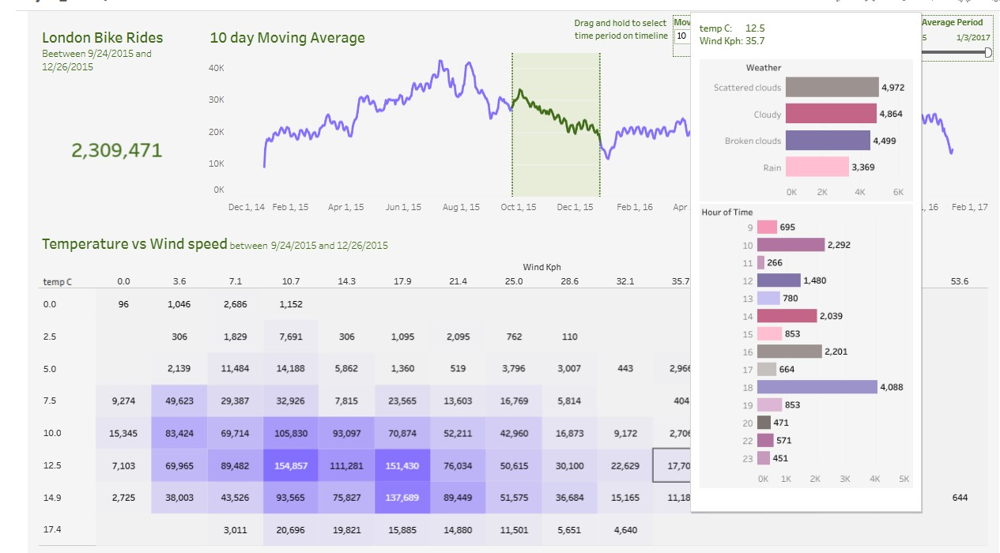

# 🚴 Exploring London Bike Ride Data: A Comprehensive Analysis

This project explores London's bike ride data, providing actionable insights through data analysis and visualization. Leveraging Python and Tableau, the project delves into ride patterns, weather correlations, and interactive visualizations to support strategic decision-making.

## 📂 Project Overview
- **Tech Stack:** Python (Pandas), Tableau  
- **Data Source:** [Kaggle API](https://www.kaggle.com/)  
- **Key Features:**
  - Ensured data integrity by acquiring and preprocessing data using the Kaggle API.
  - Cleaned and analyzed data with Python's Pandas library to uncover trends and correlations.
  - Developed dynamic Tableau dashboards for interactive exploration and detailed insights.

## 📊 Highlights
### 1. Ride Pattern Analysis
- Explored peak hours, daily/seasonal trends, and demographic preferences.
- Highlighted usage trends with engaging visualizations.

### 2. Weather Correlations
- Identified relationships between weather conditions and bike usage.
- Displayed insights through heatmaps and line graphs.

### 3. Interactive Visualizations
- Built user-friendly dashboards with filters and tooltips for deeper data exploration.
- Enhanced storytelling with intuitive design and interactivity.

## Overview Dashboard

